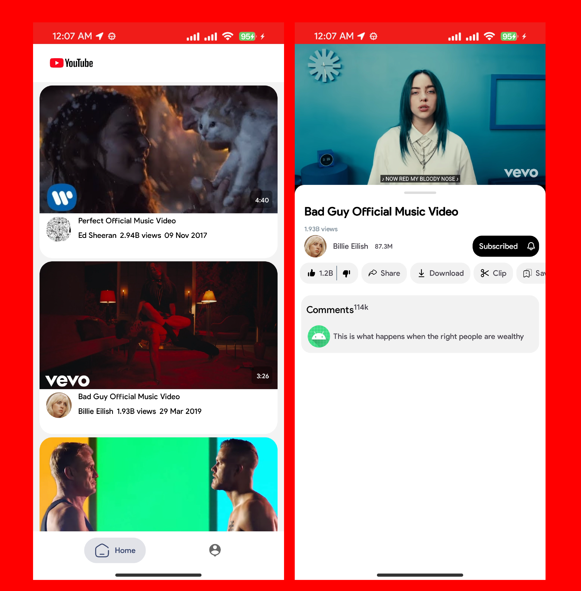

# Simple YouTube Clone App

  

## About the App

I retrieve data from custom api(https://onlineserviceagencyuk.com/api_app/videos_yt.json) and displayed with recyclerview and after click on item then open new activity and play the video automatically..
